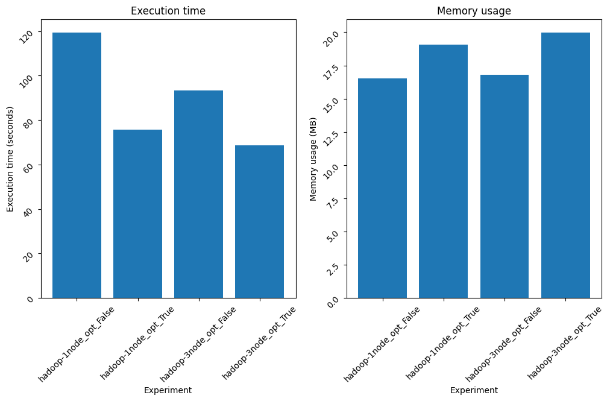

### Overview

This project processes a Spotify dataset (498,052 rows × 39 features) using Apache Spark (for distributed computing) and Hadoop (HDFS for storage).

### Setup

1. Install Python Dependencies

```
python -m venv .venv  
source .venv/bin/activate

pip install -r pyproject.toml  
```

2. Run Experiments:

```
chmod +x scripts/run_experiments.sh
./scripts/run_experiments.sh
```

### Results 

The optimized clustering implementation demonstrates faster processing times, though it requires additional memory allocation. For a detailed analysis, refer to the `notebook.ipynb`.

